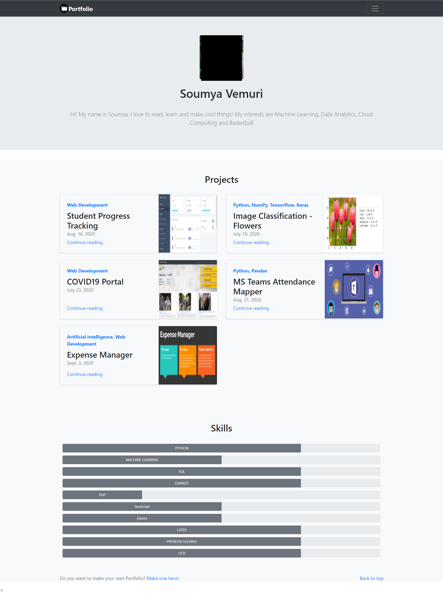
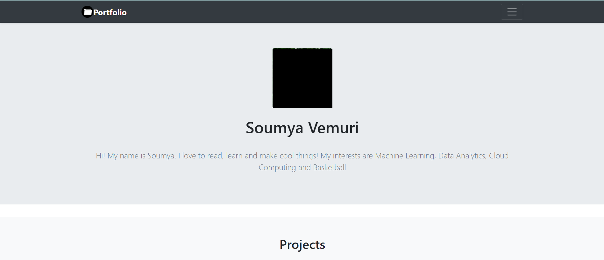
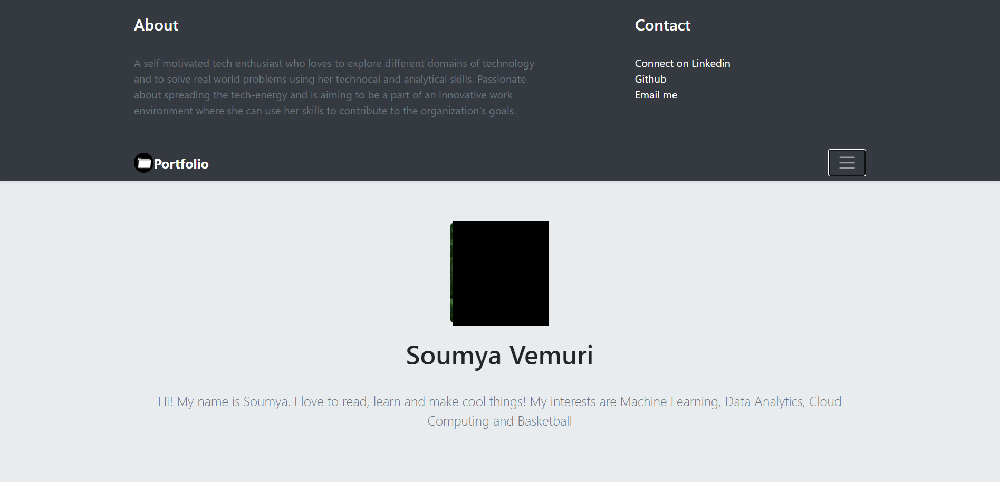
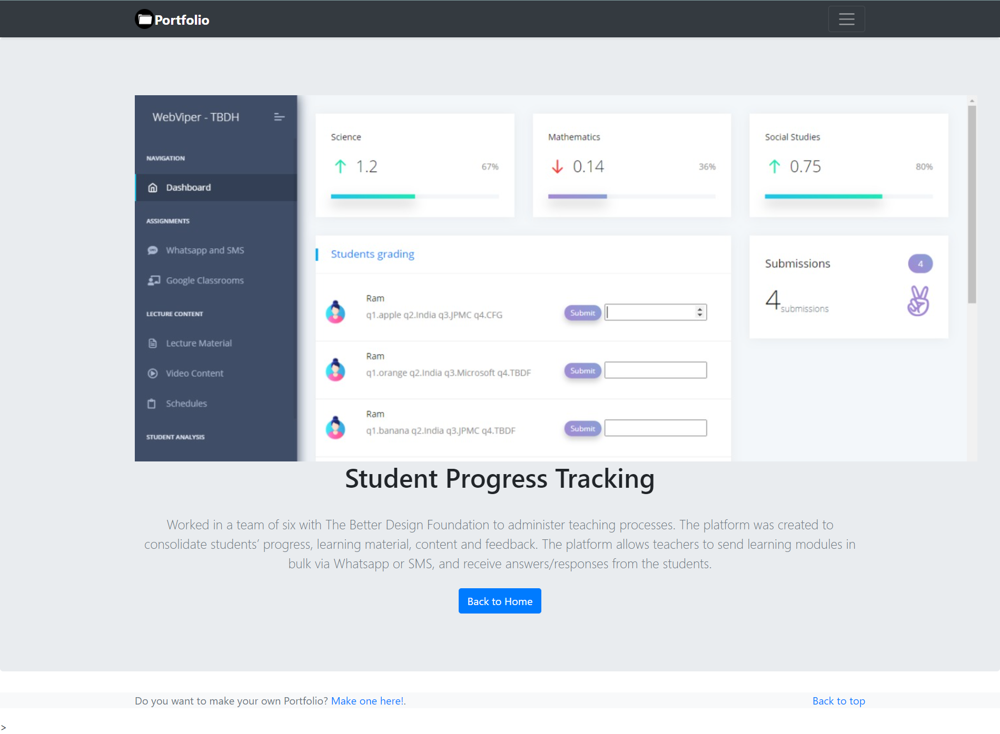
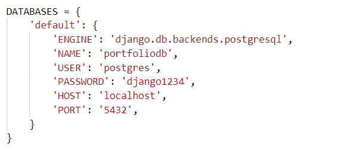
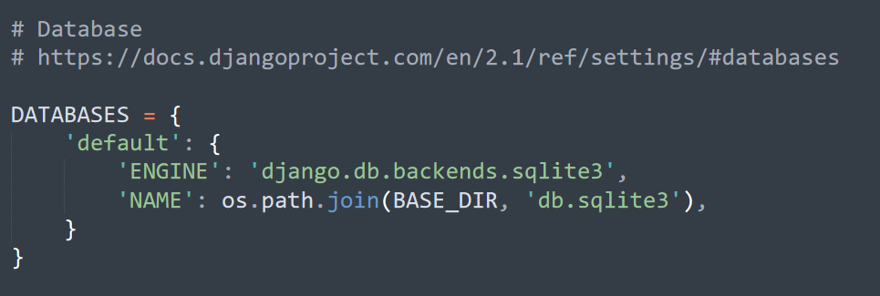

# PORTFOLIO #

## Requirements ##
- Python 3(or any later version)
- Django
- Postgres (optional)

#### This Django project consists of a basic web application to display one's portfolio ####

### Home Page ###

### Project Details Page ###

> This application uses Postgres RDBMS. Check the image below and make sure to change the database, user and password to match yours **in portfolio>portfolio>settings.py DATABASES**

>You can use any Database System you like. Or use the default SQLite supplied by django

### The login credentials for the admin page (/admin) ###
Username: user

Password: django1234

